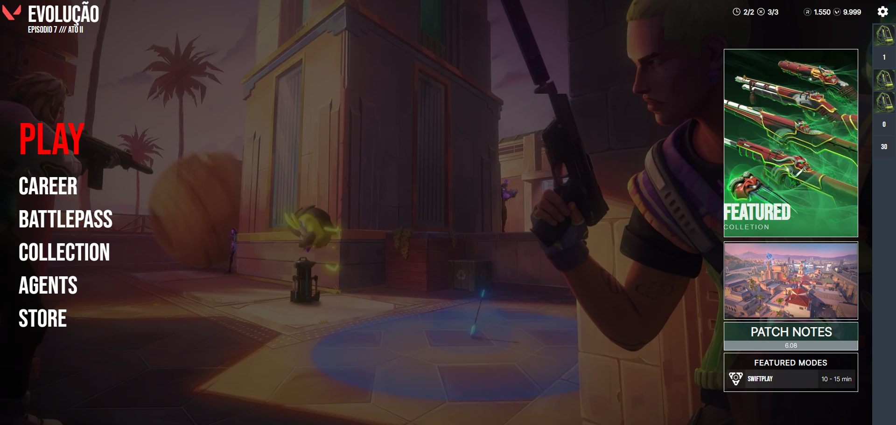

# Menu Inicial do Valorant



Este é um projeto de um menu inicial inspirado no jogo Valorant, desenvolvido com HTML, CSS e JavaScript. O objetivo deste menu é criar uma interface de usuário semelhante à do Valorant.

## Funcionalidades
Animação de Logotipo: O logotipo do Valorant é animado quando a página é carregada, proporcionando uma sensação dinâmica.

## Tecnologias Utilizadas

#### HTML: Responsável pela estrutura da página e pelos elementos.

#### CSS: Para estilizar e dar a aparência autêntica do Valorant ao menu.

## Como Utilizar

```bash
git clone https://github.com/dougaandrade/Valorant-Menu-Project.git
````
```bash
cd Valorant-Menu-Project
```
## Contribuição
<br>
Se você deseja contribuir para este projeto, sinta-se à vontade para abrir issues, enviar pull requests ou propor melhorias. Estamos abertos a colaborações!

## Créditos
<br>
Este projeto foi inspirado no jogo Valorant, desenvolvido pela Riot Games.
